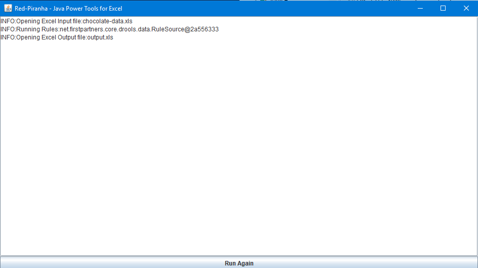

#Excel Rules example

Some Text

## What this is

Example of Red Piranha 

## Setup needed

## how to run

* Run.bat
* config

## What happens

To Cover (figure out how to do sections - read wikisyntax)
  * Link to Sample
  * Picture of example
  * why need to login
  * what is happening
  * (drools/excel/
  * calling from url

## Other ways to run

* exe in batch file
* java -jar file
* Source Located In the folder src/net/firstpartners/samples
* Unit tests (to call) are in the folder test/net/firstpartners/samples
* Each Unit test contains a 'Main' Method so that they can be called from the command line

## Notes

 